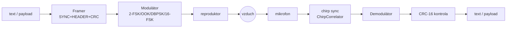

# Akustický modem

> _[sem fotka/GIF: waterfall v `modem_gui` během přenosu, nebo dva notebooky
> položené naproti sobě reproduktorem k mikrofonu]_

Přenos digitálních dat **zvukem** mezi dvěma běžnými počítači — reproduktor →
vzduch → mikrofon, žádný kabel, žádné rádio. Projekt ukazuje celý řetězec
komunikačního systému v malém: vyměnitelné modulace (2-FSK, OOK, DBPSK,
16-FSK, Q-FSK, W-FSK), rámce s CRC, chirp synchronizaci, měření chybovosti (BER/FER) a na
vrcholu i přenos IP paketů nad zvukem (`modem_tap`, TUN/TAP rozhraní).
Grafické rozhraní zobrazuje živé spektrum (waterfall), konstelační diagram a
grafy kvality signálu.

Školní projekt, důraz je na čitelnost kódu a srozumitelnost architektury
před maximálním výkonem.

## Rychlý start

### Build na Fedoře

```sh
sudo dnf install gcc-c++ cmake ninja-build SDL3-devel mesa-libGL-devel
cmake -B ~/builds/acoustic-modem -S . -G Ninja
cmake --build ~/builds/acoustic-modem
ctest --test-dir ~/builds/acoustic-modem
```

Build adresář drž **mimo Dropbox** (`-B ~/builds/acoustic-modem`) —
objektové soubory se mezi platformami stejně nepřenášejí. Bez `SDL3-devel`
se `modem_gui` automaticky vynechá, ostatní cíle to neovlivní.

### Build na macOS

```sh
xcode-select --install
brew install cmake ninja sdl3
cmake -B ~/builds/acoustic-modem -S . -G Ninja
cmake --build ~/builds/acoustic-modem
```

Při prvním `listen` macOS vyžádá oprávnění k mikrofonu (TCC) — bez potvrzení
audio vstup nepůjde. `modem_gui` běží nad OpenGL 3.2 Core (jediný profil,
který macOS pro GL nabízí). `modem_tap` na macOS používá `utun` (TUN, L3) —
Ethernet TAP je jen na Linuxu.

### Build na Windows

Vyžaduje Visual Studio 2022 (MSVC, C++20) nebo dostatečně novou MinGW-w64
distribuci (GCC 13+), CMake a [vcpkg](https://vcpkg.io/) pro SDL3.

```powershell
vcpkg install sdl3
cmake -B build -S . -G "Visual Studio 17 2022" `
    -DCMAKE_TOOLCHAIN_FILE=<cesta k vcpkg>/scripts/buildsystems/vcpkg.cmake
cmake --build build --config RelWithDebInfo
ctest --test-dir build -C RelWithDebInfo
```

Bez SDL3 (přes vcpkg) se `modem_gui` automaticky vynechá, stejně jako na
Linuxu/Fedoře — `modem_cli` a testy to neovlivní. Audio I/O jede přes
WASAPI backend miniaudia, bez nutnosti dalších závislostí.

`modem_tap` (síťový most IP přes zvuk) **na Windows zatím není podporovaný**
— vyžadoval by TUN/TAP ekvivalent Linuxova `/dev/net/tun`/macOS `utun`,
což na Windows řeší jen knihovna [Wintun](https://www.wintun.net/) (stejná
jako u WireGuardu). Zatím jde jen o vynechaný CMake target, žádná
implementace zatím neexistuje — viz TODO v `src/link/tap_device.cpp`.

### Spuštění GUI

```sh
~/builds/acoustic-modem/modem_gui
```

### CLI — offline demo (bez mikrofonu/reproduktoru)

```sh
# text → WAV
modem_cli tx --text "Ahoj, svete!" --out tx.wav

# simulace akustického kanálu (šum, drift hodin, echo)
modem_cli chansim --in tx.wav --out rx.wav --snr 15

# WAV → text zpět
modem_cli rx --in rx.wav
```

### CLI — přenos mezi dvěma stroji živým zvukem

```sh
# na přijímací straně
modem_cli listen --seconds 60

# na vysílací straně
modem_cli send --text "Ahoj z druheho stroje"
```

### CLI — měření BER pomocí PRBS

```sh
# přijímač zapisuje i surový záznam pro pozdější offline analýzu
modem_cli listen --scheme 16-FSK --seconds 120 --record prbs16.wav

# vysílač: 8 rámců po 128 B známé PRBS-15 sekvence
modem_cli send --prbs 8 --scheme 16-FSK
```

`listen` u každého PRBS rámce vypíše `BER: chyby/bity`.

### `modem_tap` — IP přes zvuk (vyžaduje sudo)

```sh
sudo modem_tap --mode tun --scheme 16-FSK
# program vypíše přesný příkaz na nastavení IP/MTU, např.:
#   sudo ip addr add 10.44.0.1/24 dev am0
#   sudo ip link set am0 up
#   sudo ip link set am0 mtu 200
# na druhém stroji spusť totéž s 10.44.0.2, pak:
ping 10.44.0.2
```

Doporučené MTU je **200 B** (payload rámce je omezen na 256 B). Přenos je
best-effort — ztráty a přeuspořádání řeší vyšší vrstvy (ICMP/TCP), jako u
běžného Ethernetu.

## Modulace

| Schéma | Princip | Bitů/symbol | Propustnost |
|---|---|---|---|
| **2-FSK** | bit → tón `f0`/`f1` | 1 | ≈ 31 bit/s @ 31,25 Bd |
| **OOK** | bit 1 → nosná zapnuta, bit 0 → ticho | 1 | ≈ 31 bit/s @ 31,25 Bd |
| **DBPSK** | bit → otočení fáze o 180° vůči předchozímu symbolu | 1 | ≈ 31 bit/s @ 31,25 Bd |
| **16-FSK** | 16 ortogonálních tónů, Grayův kód | 4 | ≈ 125 bit/s @ 31,25 Bd |
| **Q-FSK** | 4 paralelní 16-FSK skupiny (G1–G4) v pásmech mimo dozvukové zářezy | 16 | ≈ **1000 bit/s @ 62,5 Bd** |
| **W-FSK** | 11 paralelních 16-FSK skupin (G1–G11, ~1–16 kHz) — Q-FSK + G5–G11 | 44 | ≈ **2750 bit/s @ 62,5 Bd** |

Všechna schémata sdílejí stejný formát rámce a stejnou fyzickou preambuli —
podrobný rozbor parametrů a zdůvodnění voleb je v [`docs/protocol.md`](docs/protocol.md).

**Q-FSK** vysílá čtyři 16-FSK tóny současně ve čtyřech úzkých pásmech
(G1 1050–1990, G2 2800–3740, G3 4300–5240, G4 6300–7240 Hz), která sondáž
kanálu (`docs/measurements.md`) vyhodnotila jako průchozí v obou směrech —
leží mezi frekvenčně selektivními zářezy od dozvuku místnosti. 16 bitů na
symbol × 62,5 Bd dává **8× propustnost 16-FSK**. Běží na 62,5 Bd
automaticky (`--baud` volbu lze přebít). Amplituda každého tónu je 1/4
nastavené, aby součet čtyř tónů neklipoval.

**W-FSK** (wideband) rozšiřuje Q-FSK o dalších sedm skupin nad 7240 Hz
(G5 7500, G6 8750, G7 10000, G8 11250, G9 12500, G10 13750, G11 15000 Hz),
které odhalila vysokofrekvenční sondáž kanálu na macu (čistý průchod až
do ~16 kHz). 11 skupin × 4 bity = **44 bitů/symbol → 2,75 kbit/s** při
62,5 Bd (2,75× Q-FSK). Amplituda každého tónu je 1/11 nastavené (bez
klipu). Symbolová hodnota nese 44 bitů, takže celý řetězec (BitBuffer,
demodulátor, FrameReceiver) pracuje s `uint64_t`. Ověřeno akusticky
self-loopbackem na macu (BER 0/3072, SNR ≈ 25 dB); horní pásma zatím
jen na macu — Fedora→Mac klesá nad ~5,5 kHz, takže na dvoustrojovém spoji
může být W-FSK asymetrická (čeká měření na Fedoře). Pro robustní obousměrný
provoz zůstává výchozí volbou Q-FSK.

## Signálový řetězec



Technický popis architektury (vlákna, stavové automaty, DSP volby) je v
[`docs/architecture.md`](docs/architecture.md).

## Ověřené výsledky

Přenos mezi Fedorou a MacBookem vzduchem (vestavěné reproduktory/mikrofon,
stejná místnost):

- **2-FSK:** CRC OK, SNR ≈ 28 dB, korelace preambule 0,82.
- **16-FSK:** BER **0/8192** přes 8 PRBS rámců, SNR ≈ 23–25 dB — čisté i
  při 4× vyšší propustnosti.
- **DBPSK:** BER **0/3072** přes 3 PRBS rámce, SNR ≈ 18,5–20 dB.
- **OOK:** BER **0/3072** přes 3 PRBS rámce, SNR ≈ 21,6–22,3 dB.
- **Q-FSK:** self-loopback na macu (reproduktor→vzduch→vlastní mikrofon),
  BER **0/3072** přes 3 PRBS rámce, SNR ≈ 28 dB — dvoustrojová matice
  Fedora↔Mac čeká.
- **W-FSK:** self-loopback na macu, BER **0/3072** přes 3 PRBS rámce,
  SNR ≈ 25 dB při 2,75 kbit/s — horní pásma zatím jen na macu (Fedora→Mac
  klesá nad ~5,5 kHz), dvoustrojové měření čeká.
- **IP přes zvuk (`modem_tap`):** obousměrný ping vzduchem, RTT ≈ 13–14 s
  (84 B ICMP @ ~125 bit/s) — viz [`docs/measurements.md`](docs/measurements.md).

Podrobná metodika, kompletní tabulky a forenzní rozbor jedné anomálie
(xrun na TX straně) jsou v [`docs/measurements.md`](docs/measurements.md).

## Struktura repozitáře

```
src/
  core/       konfigurace, bitový proud, WAV I/O, SPSC ring buffer, PRBS-15
  dsp/        chirp, Goertzelův filtr, FIR, simulace kanálu
  modem/      modulátory/demodulátory (2-FSK, OOK, DBPSK, 16-FSK, Q-FSK, W-FSK) + registr
  protocol/   CRC-16, sestavení rámců (Framer), příjem rámců (FrameReceiver)
  link/       CSMA MAC (AcousticLink) a TUN/TAP zařízení pro modem_tap
  audio/      obálka nad miniaudio (real-time I/O)
  app/        modem_gui — DSP vlákno, waterfall, ImGui panely
  net/        modem_tap — síťový mostík
  cli/        modem_cli
tests/        jednotkové a integrační testy (doctest)
docs/         protokol, architektura, měření, spolupráce agentů
sync/         koordinace mezi Linux a Mac agentem přes Dropbox (viz sync/README.md)
third_party/  doctest, kissfft, Dear ImGui, ImPlot, miniaudio
```

## Stav milníků

| Milník | Popis | Stav |
|---|---|---|
| M1 | Jádro: konfigurace, bity, WAV I/O, CRC-16, 2-FSK, rámce, CLI | hotovo |
| M2 | Simulace kanálu, testovací sada (BER, chain testy) | hotovo |
| M3 | Reálný zvukový vstup/výstup (miniaudio) | hotovo |
| M4 | GUI (ImGui/ImPlot): živé spektrum, konstelace, metriky | hotovo |
| M5 | Další modulace: OOK, DBPSK, 16-FSK | hotovo |
| M6 | Měření BER/FER na reálném kanálu (PRBS) | hotovo — obousměrná matice, BER 0 |
| M7 | Síťová vrstva (`modem_tap`, CSMA MAC) | hotovo — ping vzduchem, RTT ~13 s |
| M8 | Závěrečná zpráva ([`docs/zprava.md`](docs/zprava.md)) | hotovo |
| M9 | Rychlejší modulace (Q-FSK 1 kbit/s, W-FSK 2,75 kbit/s) | implementováno + testy; self-loopback BER 0, dvoustrojové měření čeká |

## Licence a kredity

Vendorované knihovny v `third_party/` (nemodifikované, každá se svou licencí):

- [**miniaudio**](https://miniaud.io/) — public domain / MIT-0
- [**kissfft**](https://github.com/mborgerding/kissfft) — BSD-3-Clause
- [**Dear ImGui**](https://github.com/ocornut/imgui) — MIT
- [**ImPlot**](https://github.com/epezent/implot) — MIT
- [**doctest**](https://github.com/doctest/doctest) — MIT

Font [**Roboto**](https://fonts.google.com/specimen/Roboto) (Apache-2.0)
je vestavěný v `modem_gui` (`src/app/ui_font.hpp`, komprimovaná forma TTF
z distribuce Dear ImGui) kvůli českým glyfům.
