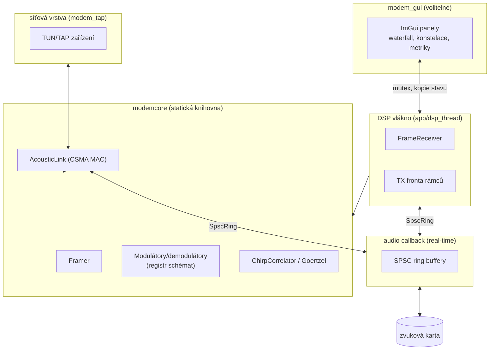
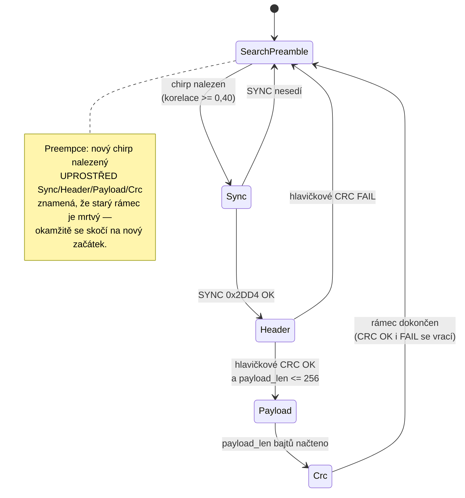
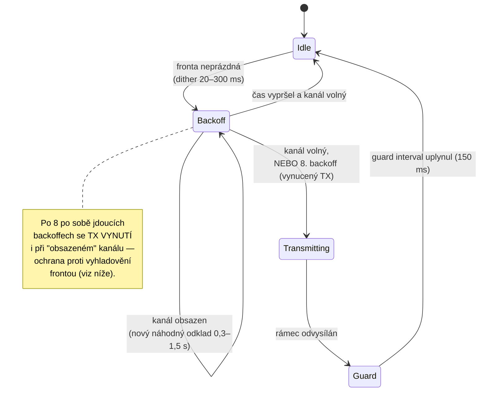

# Architektura

Tento dokument popisuje technické řešení akustického modemu: rozdělení do
vrstev, vláknový model a klíčová rozhodnutí v DSP a síťové vrstvě. Doplňuje
[`protocol.md`](protocol.md) (přesný formát rámce) — tady je důraz na *proč*
je systém postavený tak, jak je, a jak spolu jednotlivé části komunikují.

## Vrstvy



`modemcore` je sdílená statická knihovna bez závislosti na zvuku či GUI —
DSP, modulace a protokol jsou čisté funkce nad vektory vzorků, takže je
testuje `modem_tests` bez jakéhokoli hardwaru. `modemaudio` je tenká vrstva
nad miniaudio, oddělená proto, aby jednotky bez potřeby zvukového HW
(testy) netáhly systémové audio závislosti. `modem_cli`, `modem_gui` a
`modem_tap` jsou tři nezávislé aplikace nad stejným jádrem.

## Stavový automat: FrameReceiver

`FrameReceiver` je streamovací přijímač — dostává vzorky v libovolně
velkých blocích (z ring bufferu i z WAV souboru) a udržuje si mezi voláními
kompletní stav.



Několik detailů, které se v diagramu neukážou:

- **Návrat při selhání SYNC/hlavičky se nevrací na `read_pos_`, ale na
  polovinu symbolu za `frame_start_`.** Důvod je nasbíraný z reálného
  nálezu při testování s druhým strojem (viz `docs/measurements.md`):
  naivní implementace skákala rovnou na aktuální pozici čtení, čímž mohla
  nenávratně přeskočit *skutečný* chirp, který dorazil, zatímco přijímač
  marně čekal na dokončení falešně zamčeného rámce. Návrat těsně za
  detekovaný (falešný) chirp dává hledání preambule šanci najít ten
  správný.
- **Preempce se kontroluje jednou za volání `pushSamples`, ne za symbol** —
  hledá chirp v okně od `read_pos_ - (délka chirpu + mezery)` dál, protože
  demodulátor mohl začátek nového chirpu už spolykat jako (nesmyslné)
  datové symboly rozpracovaného rámce.
- **Ořezávání bufferu** drží dostatečnou rezervu pro zpřesnění korelační
  špičky; ve stavech `Sync`/`Header` navíc drží celý rámec od
  `frame_start_`, protože právě tam se řízení vrací při selhání — tyto
  stavy jsou shora omezené na ~27 symbolů, takže paměťový nárůst je
  ohraničený.
- **`kRefSymbols = 1` referenční symbol** (samé jedničky) se posílá před
  SYNC pro všechna schémata jednotně a `FrameReceiver` ho spolkne jako
  součást `Sync` fáze (offset `kRefSymbols * bps` v bitovém okně) — přijímač
  ho nikdy nevidí jako samostatný stav.

## Stavový automat: AcousticLink (CSMA MAC)

`AcousticLink` řeší poloduplexní přístup ke sdílenému kanálu (vzduchu) pro
`modem_tap` — obě strany mají jeden reproduktor a jeden mikrofon a neumí
současně vysílat a poslouchat (mikrofon by slyšel vlastní reproduktor).



- **Dither před každým vysíláním** (20–300 ms náhodně) řeší kolizi dvou
  stanic, které se rozhodnou vysílat ve stejný okamžik — pozdější z nich
  uslyší warm-up tón té dřívější a ustoupí do backoffu, místo aby obě
  vysílaly najednou (obdoba CSMA/CA ve Wi-Fi).
- **`channelBusy()`** je pravda, když `FrameReceiver` není ve stavu
  `SearchPreamble` (rozpracovává cizí rámec) NEBO když klouzavý RMS vstupu
  přesáhne práh (`busy_input_rms`, výchozí 0,02) — tedy i cizí preambule
  nebo neidentifikovatelný hluk drží kanál jako obsazený.
- **Forced TX po 8 backoffech** je záchrana proti vyhladovění TX fronty:
  falešný lock přijímače na šum (nebo vadně dekódovaná délka payloadu) by
  jinak mohl `channelBusy()` držet na `true` donekonečna. Riziko kolize je
  menší zlo než mrtvá fronta.
- **Guard interval (150 ms)** po vysílání nechá doznít dozvuk místnosti,
  než se přijímač znovu spolehne na `SearchPreamble`; `Transmitting` i
  `Guard` navíc zahazují všechny přijaté vzorky (`rx_.reset()` na hranicích
  stavů) — jinak by modem dekódoval sám sebe.
- Statistiky (`tx_frames`, `rx_ok`, `rx_crc_fail`, `backoffs`, `forced_tx`)
  se vypisují periodicky v `modem_tap` (každých 10 s) pro diagnostiku za
  provozu.

## Vláknový model

```
                    ┌─────────────────────────┐
   mikrofon ──────▶ │  audio callback (RT)     │
                    │  (miniaudio, cizí vlákno)│
                    └───────────┬──────────────┘
                                │ SpscRing<float> rx_ring   (lock-free)
                                ▼
                    ┌─────────────────────────┐
                    │  DSP vlákno              │
                    │  FrameReceiver, waterfall│◀── mutex ──▶  GUI vlákno
                    │  AcousticLink (modem_tap)│               (ImGui)
                    └───────────┬──────────────┘
                                │ SpscRing<float> tx_ring   (lock-free)
                                ▼
                    ┌─────────────────────────┐
   reproduktor ◀─── │  audio callback (RT)     │
                    └─────────────────────────┘
```

**Proč SPSC lock-free jen v audio callbacku, a mutexy jinde:** zvukový
callback běží na vlákně řízeném ovladačem/OS s tvrdým časovým rozpočtem —
zablokování na mutexu (např. kvůli GUI vláknu, které zrovna čte konfiguraci)
by způsobilo audio glitch (xrun) slyšitelný jako lupanec nebo výpadek.
`SpscRing<float>` (`src/core/spsc_ring.hpp`) proto používá jeden atomický
pár `head_`/`tail_` s acquire/release synchronizací — funguje, protože na
každém konci je *přesně jeden* producer a jeden consumer. GUI a DSP vlákno
naproti tomu nemají real-time nárok (o pár milisekund zpoždění ve
vykreslení nikdo nepozná), takže si tam obyčejný `std::mutex`
(`DspThread::mtx_`) může dovolit chránit sdílený stav (frontu TX rámců,
statistiky, konfiguraci) bez rizika audio glitche.

Velikosti ringů jsou dimenzované na celé rámce: `rx_ring_` má `1u << 20`
vzorků (~22 s při 48 kHz), `tx_ring_` `1u << 22` (~87 s) — rámec se vkládá
vcelku, ne po kouskách, takže musí mít kam.

Kompletní rozpis vláken ve všech čtyřech aplikacích (`modem_cli`,
`modem_gui`, `modem_tap`) a všech kritických sekcí — co přesně chrání
který zámek/atomik a proč — je v [`threads.md`](threads.md).

## DSP

### Goertzel místo FFT

Modem potřebuje energii (a u DBPSK fázi) jen v `bitsPerSymbol()`-násobku
konkrétních, předem známých frekvencí — 2 u 2-FSK/OOK/DBPSK, 16 u 16-FSK.
Goertzelův algoritmus (`src/dsp/goertzel.hpp`) spočítá jeden komplexní
koeficient v čase O(N) bez nutnosti počítat (a alokovat) celé spektrum FFT
o N/2 binech, z nichž by se stejně použilo jen několik. Je to zároveň
didakticky čistší: `Goertzel::run()` je jasně čitelná lineární rekurence
místo motýlkových sítí. `kissfft` je v projektu přítomen jen pro budoucí
spektrální zobrazení ve waterfallu, ne pro demodulaci.

### Chirp synchronizace

Fyzická preambule nese lineární chirp 800–2800 Hz, 100 ms, s Hannovou
obálkou na okrajích. Autokorelace lineárního chirpu dává jednu ostrou, úzkou
špičku — na rozdíl od periodického tónu, jehož autokorelace má hřeben
falešných špiček při každém celočíselném posunu o periodu. Chirp navíc
pokrývá široké pásmo, takže korelační špička přežije frekvenčně selektivní
odezvu místnosti (dozvuk, hrany pásma reproduktoru/mikrofonu) lépe než
úzkopásmový signál.

`ChirpCorrelator` (`src/dsp/chirp.hpp`) běží ve dvou krocích z výkonových
důvodů:

1. **Decimovaná korelace** — vstup se filtruje FIR dolní propustí a
   decimuje 4× (48 → 12 kHz), korelace proti decimovanému vzoru chirpu
   běží na tomto sníženém vzorkovacím kmitočtu.
2. **Zpřesnění (refine)** — okolí nalezené hrubé špičky se doupřesní na
   plném 48kHz rozlišení, aby hranice prvního symbolu byla přesná na
   jednotky vzorků, ne na 4násobek.

Nalezená hranice = index prvního vzorku *za* koncem chirpu a 20ms mezery —
tj. přesně začátek prvního modulovaného symbolu (referenčního).

### CPFSK — spojitá fáze

2-FSK a 16-FSK generují signál s fázovým akumulátorem (`phase_`), který
běží **přes hranice symbolů** — při změně tónu se nezačíná od fáze 0, ale
pokračuje se odkud fáze doběhla. Tím signál nemá skoky (nespojitosti) na
hranicích symbolů, což znamená užší spektrum a žádné lupance způsobené
širokopásmovým impulzem při přepnutí dvou nezávislých oscilátorů.

### DBPSK: diferenciální detekce a kompenzace necelých cyklů

DBPSK kóduje bit jako **změnu** fáze nosné mezi sousedními symboly (otočení
o 180° = bit 1, beze změny = bit 0), ne jako fázi samotnou. Koherentní BPSK
by vyžadovala obnovu absolutní fáze nosné (Costasova smyčka), která musí
sledovat trvalou rotaci fáze způsobenou rozdílem hodin dvou nezávislých
zvukových karet. Diferenciální detekce porovnává jen sousední symboly —
pomalá rotace mezi symboly je zanedbatelná (při driftu ±0,5 Hz na nosné by
šlo o ~6°/symbol proti rozhodovací rezervě 90°) a vyruší se. Cena je ~3 dB
horší odstup signál/šum oproti koherentní PSK, což je při dosažených SNR
(20–30 dB) nepodstatné.

**Kompenzace necelých cyklů na symbol:** `f0 = 1200 Hz` a `baud = 31,25 Bd`
dává `1200 / 31,25 = 38,4` cyklů nosné na symbol — **není to celé číslo**.
To znamená, že i beze změny datového bitu se fázor nosné mezi sousedními
Goertzelovými okny pootočí o `2π · frac(38,4) = 2π · 0,4`, tedy o **144°**.
Bez kompenzace by diferenciální detektor (`Re(c_k · conj(c_{k-1})) < 0`)
tuhle deterministickou rotaci četl jako datové otočení a hádal by bity
špatně v polovině případů. Demodulátor proto v `configure()` spočítá
`theta = 2π · frac(f0 · sps / sample_rate)` a před porovnáním vynásobí
diferenciální fázor korekčním otočením `rot_ = e^(-iθ)`, které tuhle
předvídatelnou složku odstraní — zbyde jen skutečný datový příznak (0°/180°).

### 16-FSK: ortogonalita a Gray kód

16 tónů `1000 + k·62,5 Hz` (`k = 0..15`, tedy 1000–1937,5 Hz) nese 4 bity za
symbol — 4× propustnost 2-FSK při stejné symbolové rychlosti. Rozestup
tónů (62,5 Hz = 2× baud) je zvolen tak, aby byl **celočíselný násobek
baudu** — Goertzelův filtr naladěný na jeden tón má v poloze sousedního
tónu přesně nulu (hlavní lalok funkce sinc má nuly v násobcích 1/T, kde T
je délka okna = doba symbolu). Sousední tóny se tak nepřelévají do sebe
uvnitř obdélníkového okna symbolu.

Index vítězného tónu se před převodem na bity dekóduje z **Grayova kódu**
(`grayEncode`/`grayDecode`, `src/core/bits.hpp`) — sousední indexy tónů se
liší přesně jedním bitem, takže nejpravděpodobnější chyba demodulace (záměna
za frekvenčně sousední tón kvůli šumu nebo dozvuku) poškodí jen 1 ze 4 bitů
symbolu místo náhodných až 4.

### OOK: adaptivní práh

On-off keying (bit 1 = nosná zapnuta, bit 0 = ticho) nemá druhý tón, proti
kterému by se dalo přímo poměřovat jako u FSK — rozhoduje se proti prahu.
Demodulátor drží dva klouzavé odhady energie (EMA, koeficient 0,15): `on_avg`
a `off_avg`. Práh je jejich **geometrický průměr** `sqrt(on_avg · off_avg)`,
tedy střed mezi ON a OFF v decibelové (logaritmické) škále, ne v lineární —
to dává symetrickou rozhodovací rezervu v dB oběma směry. Odhady se seedují
referenčním symbolem před SYNC, který je podle protokolu vždy jedničkový
(nosná ON): první přijatý symbol tedy rovnou inicializuje `on_avg`, a
protože SYNC slovo `0x2DD4` obsahuje obě hodnoty bitů, oba odhady se hned
poté rychle zpřesní i pro OFF.

## Drift hodin a pevné symbolové hodiny

Vysílač a přijímač mají nezávislé zvukové karty s vlastními krystalovými
oscilátory — jejich vzorkovací kmitočty se liší o typicky jednotky až
desítky ppm (parts per million). `FrameReceiver` tento drift **neřeší
průběžně**: chirp korelace zafixuje hranici prvního symbolu jednou na
začátku rámce a odtud se dál krájí pevná okna `samplesPerSymbol()` vzorků
— žádné opětovné zamykání uvnitř rámce.

Zdůvodnění, proč to stačí (viz i `docs/protocol.md`): při typickém driftu
řádu 10 ppm a rámci o maximální délce `kMaxPayload = 256 B` je celkový počet
symbolů v rámci:

```
symboly ≈ (2 (SYNC) + 40 (header, 3 B) + 256×8 (payload) + 16 (CRC)) / bps
```

Pro nejpomalejší schéma (1 bit/symbol) je to zhruba 2094 bitů/symbolů. Doba
trvání rámce při 31,25 Bd je `2094 / 31,25 ≈ 67 s`... ale to je horní mez
pro plný 256B payload; typické textové zprávy v testech (desítky bajtů)
trvají řádově sekundy. I při 67 s a driftu 10 ppm je kumulovaná časová
odchylka `67 s × 10×10⁻⁶ ≈ 0,67 ms` — vůči délce symbolu `1/31,25 Hz = 32 ms`
je to necelá **2,1 %** v nejhorším případě, a pro typické krátké rámce o
řád méně. Volba `kMaxPayload = 256 B` je právě kompromis: dost dlouhá pro
rozumnou zprávu nebo ethernetový rámec s malým MTU, dost krátká, aby drift
zůstal hluboko pod zlomkem trvání symbolu (komentář v `core/config.hpp`
udává cíl < 0,5 % pro typický provoz). Delší rámec by si vyžádal vlastní
kompenzaci driftu uvnitř rámce (např. periodické re-synchronizační
značky), ne jen jednorázovou korekci na hranici preambule.

## Síťová vrstva: TUN vs. TAP vs. utun

`TunTapDevice` (`src/link/tap_device.hpp`) abstrahuje virtuální síťové
rozhraní ve dvou režimech:

- **TUN** — vrstva 3: čisté IP pakety bez ethernetové hlavičky. Přenositelné
  — funguje na Linuxu i macOS (kde se linuxové `/dev/net/tun` nahrazuje
  `utun` control socketem; jméno rozhraní si na macOS přiděluje systém,
  typicky `utunN`).
- **TAP** — vrstva 2: celé ethernetové rámce včetně hlaviček. Jen Linux —
  macOS nemá standardní TAP bez kernel extension.

`modem_tap` (`src/net/main_tap.cpp`) běží jako jednoduchá smyčka: `poll()`
na file descriptoru rozhraní, přečtený paket předá `AcousticLink::sendPacket`,
periodicky volá `AcousticLink::tick()` a vyprázdní frontu přijatých paketů
zpět do rozhraní. Žádné vlákno navíc — `readPacket`/`writePacket` jsou
neblokující.

**MTU 200 B** je doporučené nastavení (program ho vypíše i v instrukcích při
startu): payload rámce je tvrdě omezen na `kMaxPayload = 256 B` a je potřeba
rezerva na IP/TCP hlavičky uvnitř tunelovaného paketu.

**CSMA** (viz stavový diagram výše) je nutný, protože vzduch je sdílené
polo­duplexní médium — na rozdíl od skutečného Ethernetu s kroucenou dvoulinkou
zde neexistuje plný duplex ani kolizní doména menší než "celá místnost".

**Best-effort** znamená, že `AcousticLink` negarantuje doručení ani pořadí:
ztracené nebo poškozené (CRC FAIL) rámce se tiše zahazují, žádné
opakování na úrovni modemu neexistuje. Pro ICMP to znamená občasné ztracené
pingy (viditelné jako timeouty), pro TCP retransmise a znatelně nižší
efektivní propustnost než nominální bitrate schématu — přesně jako by TCP
běželo přes jakoukoliv ztrátovou linku (starý pomalý modem, slabý Wi-Fi
signál). Zotavení je úkolem vyšších vrstev v IP zásobníku, ne modemu.
